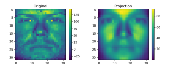

### Yale Face PCA
Program takes 2414 sample images (32x32 in size) from the Yale face dataset and implements the program component analysis (PCA) equation to find each pictures average projection. 

